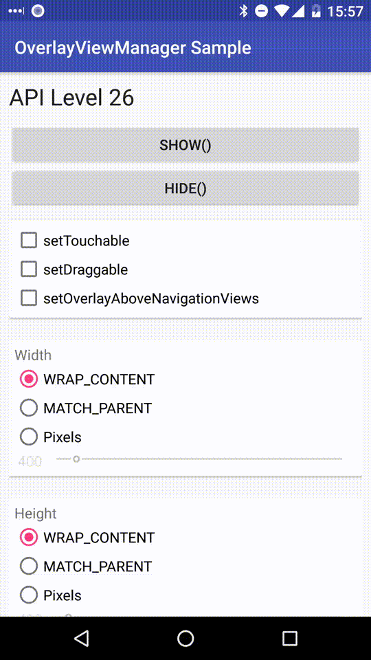

# OverlayViewManager [](https://jitpack.io/#75py/Android-OverlayViewManager) [](https://codebeat.co/projects/github-com-75py-android-overlayviewmanager-master)

OverlayViewManager is a lightweight Android library that allows you to overlay views on top of other apps, providing a simple interface to manage and customize these overlays. This library is particularly useful for creating floating widgets or overlays that need to be displayed across the entire system, regardless of the activity or app in the foreground.

Try out [the sample application on Google Play](https://play.google.com/store/apps/details?id=com.nagopy.android.overlayviewmanager.sample).

## Features

- **Easy to Use**: Simple API to create and manage overlay views.
- **Customizable**: Supports various customization options like touchable, draggable, and view positioning.
- **Lifecycle Management**: Manages the overlay view lifecycle based on activity or application context.
- **Permission Handling**: Provides methods to check and request overlay permissions.

## Installation


Latest version: [](https://jitpack.io/#75py/Android-OverlayViewManager)

Step 1. Add the JitPack repository to your build file
```groovy
	dependencyResolutionManagement {
		repositoriesMode.set(RepositoriesMode.FAIL_ON_PROJECT_REPOS)
		repositories {
			mavenCentral()
			maven { url 'https://jitpack.io' }
		}
	}
```

Step 2. Add the dependency
```groovy
dependencies {
    implementation 'com.github.75py.Android-OverlayViewManager:overlayviewmanager:{version}'
}
```

## Usage

### Initialization

Initialize the `OverlayViewManager` in your `Application` class:

```java
public class MyApplication extends Application {
    @Override
    public void onCreate() {
        super.onCreate();
        OverlayViewManager.init(this);
    }
}
```

### Creating an Overlay View

To create an overlay view, use the `OverlayViewManager` to get an instance of `OverlayView`:

```java
OverlayViewManager overlayViewManager = OverlayViewManager.getInstance();
TextView overlayTextView = new TextView(this);
overlayTextView.setText("Hello, World!");

OverlayView<TextView> overlayView = overlayViewManager.newOverlayView(overlayTextView);
```

### Displaying the Overlay View

To display the overlay view, call the `show` method:

```java
overlayView.show();
```

### Hiding the Overlay View

To hide the overlay view, call the `hide` method:

```java
overlayView.hide();
```


### Customizing the Overlay View

You can customize various properties of the overlay view, such as its position, size, and touch behavior:

```java
overlayView
    .setWidth(ViewGroup.LayoutParams.WRAP_CONTENT)
    .setHeight(ViewGroup.LayoutParams.WRAP_CONTENT)
    .setTouchable(true)
    .setDraggable(true)
    .setGravity(Gravity.TOP | Gravity.START)
    .setX(100)
    .setY(100)
    .setAlpha(0.8f);
```




### Handling Permissions

To check if the app has overlay permissions, use the `canDrawOverlays` method:

```java
if (!overlayViewManager.canDrawOverlays()) {
    // Request permission
    overlayViewManager.requestOverlayPermission();
}
```

To show a permission request dialog:

```java
overlayViewManager.showPermissionRequestDialog(getSupportFragmentManager(), R.string.app_name);
```

## Example

Here is a complete example of how to use the `OverlayViewManager`:

```java
public class MainActivity extends AppCompatActivity {

    @Override
    protected void onCreate(Bundle savedInstanceState) {
        super.onCreate(savedInstanceState);

        // Initialize OverlayViewManager
        OverlayViewManager.init(getApplication());

        // Create a new overlay view
        TextView overlayTextView = new TextView(this);
        overlayTextView.setText("Hello, Overlay!");

        OverlayView<TextView> overlayView = OverlayViewManager.getInstance().newOverlayView(overlayTextView);

        // Set properties
        overlayView
            .setWidth(ViewGroup.LayoutParams.WRAP_CONTENT)
            .setHeight(ViewGroup.LayoutParams.WRAP_CONTENT)
            .setTouchable(true)
            .setDraggable(true)
            .setGravity(Gravity.TOP | Gravity.START)
            .setX(100)
            .setY(100)
            .setAlpha(0.8f);

        // Show the overlay view
        overlayView.show();
    }
}
```

## License

```
Copyright 2017 75py

Licensed under the Apache License, Version 2.0 (the "License");
you may not use this file except in compliance with the License.
You may obtain a copy of the License at

   http://www.apache.org/licenses/LICENSE-2.0

Unless required by applicable law or agreed to in writing, software
distributed under the License is distributed on an "AS IS" BASIS,
WITHOUT WARRANTIES OR CONDITIONS OF ANY KIND, either express or implied.
See the License for the specific language governing permissions and
limitations under the License.
```
