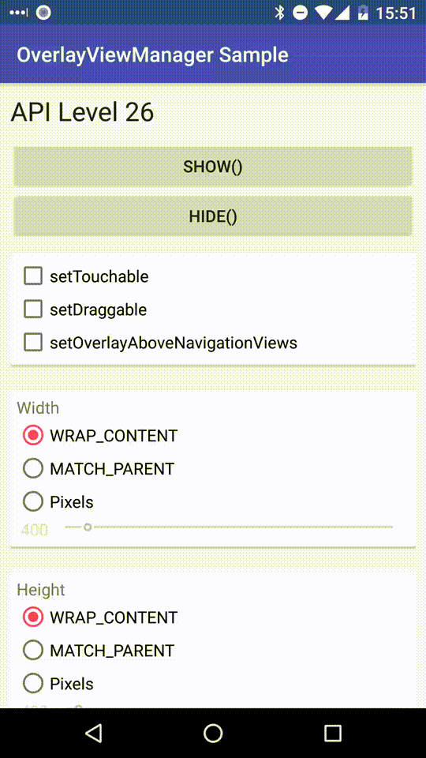
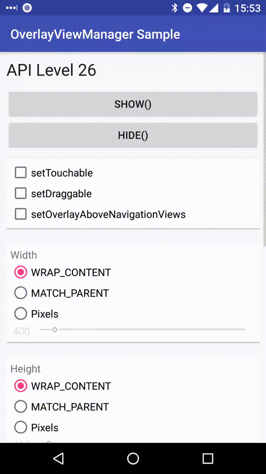
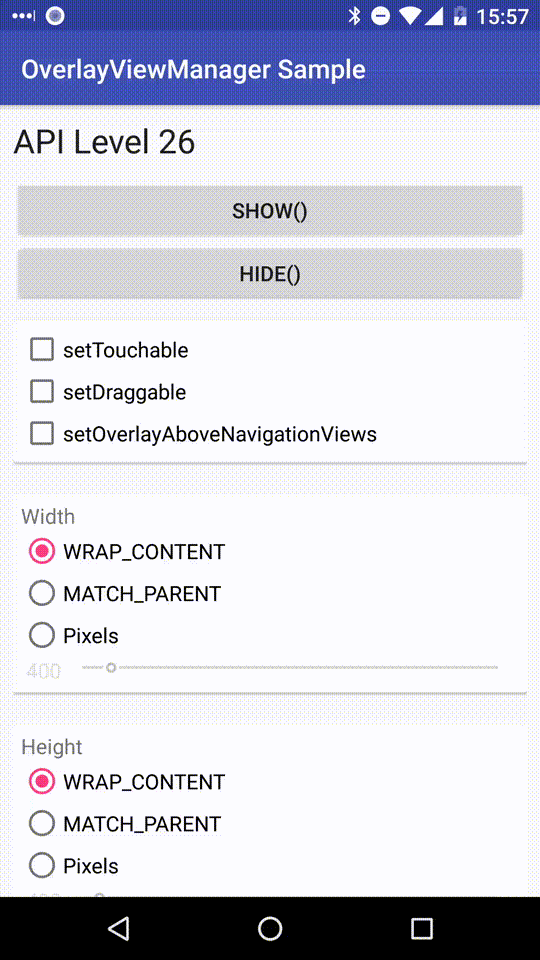

# Android OverlayViewManager [](https://codebeat.co/projects/github-com-75py-android-overlayviewmanager-main)

OverlayViewManager provides simple API for displaying overlay your views.

Try out [the sample application on Google Play](https://play.google.com/store/apps/details?id=com.nagopy.android.overlayviewmanager.sample).

## Usage

### Check permissions and request if needed

```java
OverlayViewManager overlayViewManager = OverlayViewManager.getInstance();
if (!overlayViewManager.canDrawOverlays()) {
    overlayViewManager.showPermissionRequestDialog(getSupportFragmentManager(), R.string.app_name);
}
```

### Create OverlayView instance

```java
OverlayView overlayView = overlayViewManager.newOverlayView(yourView);
```

### Start and stop overlay

```java
// Start overlay
overlayView.show();

// Stop overlay
overlayView.hide();
```


### OverlayView#setTouchable(boolean)

```java
OverlayView overlayView = overlayViewManager.newOverlayView(yourView)
    // .setTouchable(false) default
    .show();

overlayView.setTouchable(true)
    .update();
```




### OverlayView#setDraggable(boolean)

```java
OverlayView overlayView = overlayViewManager.newOverlayView(yourView)
    // .setDraggable(false) default
    .show();

overlayView.setDraggable(true)
    .update();
```




### OverlayView#setWidth(int)

```java
OverlayView overlayView = overlayViewManager.newOverlayView(yourView)
    // .setWidth(WRAP_CONTENT) default
    .show();

overlayView.setWidth(MATCH_PARENT)
    .update();

overlayView.setWidth(400)
    .update();
```



### Other functions

* OverlayViewManager
    * OverlayView<View> newOverlayView(View, Activity)
    * int getDisplayWidth()
    * int getDisplayHeight()
* OverlayView
    * setHeight(int)
    * setGravity(int)
    * setGravity(int)
    * and more

## Installation

### Download

Latest version: %%version%%

```groovy
dependencies {
    implementation 'com.nagopy.android:overlayviewmanager:%%version%%'
}
```

### Setup

Call OverlayViewManager.init() in the onCreate() of your Application class.
```java
public class YourApplication extends Application {

    @Override
    public void onCreate() {
        super.onCreate();
        OverlayViewManager.init(this);
    }

}
```

## DebugOverlayTree

An option for Timber users.  
DebugOverlayTree shows debug logs by OverlayView.

```groovy
dependencies {
    implementation 'com.nagopy.android:overlayviewmanager:%%version%%'
    implementation 'com.jakewharton.timber:timber:4.7.1'
}
```

```java
public class SampleApplication extends Application {

    @Override
    public void onCreate() {
        super.onCreate();

        OverlayViewManager.init(this);

        if(BuildConfig.DEBUG) {
            // Initialize and plant DebugOverlayTree instance
            Timber.plant(DebugOverlayTree.init(this));
        }
    }

}
```

```java
public class SampleTimberActivity extends AppCompatActivity {

    @Override
    protected void onCreate(@Nullable Bundle savedInstanceState) {
        super.onCreate(savedInstanceState);

        // Register this Activity
        DebugOverlayTree.getInstance().register(this);

        setContentView(R.layout.activity_sample_timber);

        Timber.d("onCreate");
    }

}
```

## License

```
Copyright 2017 75py

Licensed under the Apache License, Version 2.0 (the "License");
you may not use this file except in compliance with the License.
You may obtain a copy of the License at

   http://www.apache.org/licenses/LICENSE-2.0

Unless required by applicable law or agreed to in writing, software
distributed under the License is distributed on an "AS IS" BASIS,
WITHOUT WARRANTIES OR CONDITIONS OF ANY KIND, either express or implied.
See the License for the specific language governing permissions and
limitations under the License.
```
